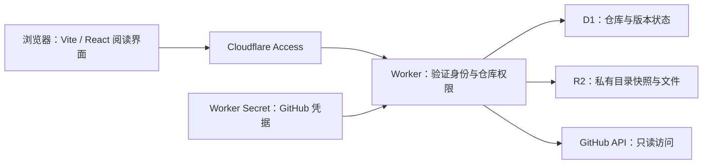

# 02 · GitHub 认证、缓存与更新

状态：**PAT 方案已实现并通过本地验收；尚未配置生产凭据**

更新：2026-09-11

## 已接受的方案

针对“单用户、私有仓库主要属于一个 GitHub 用户”的已确认场景，首版采用：

**Cloudflare Access + 细粒度只读 PAT + Worker + D1 元数据 + 私有 R2 内容缓存。**

用户已明确选择 PAT，接受定期轮换，并授权开始实现。本轮采用 D1 元数据、
私有 R2、客户端阅读渲染及按需同步；本地使用 Wrangler 的 SQLite D1 和 R2
模拟，并用独立的 GitHub mock 提供充分的演示数据。实施细节见
[04 · 实现与本地验收](04-implementation-and-local-testing.md)。

## 两层认证

Cloudflare Access 回答“谁能打开 Ocelot”；GitHub 凭据回答“Worker 能读取
哪些仓库”。即使 Access 使用 GitHub 作为登录身份提供方，也不会因此得到
读取 GitHub 私有仓库的 API 权限。

| 方案 | 权限与保存方式 | 操作体验与代价 | 建议 |
| --- | --- | --- | --- |
| 细粒度 PAT | 单个 resource owner、选定仓库、`Contents: read`，保存到 Worker Secret | 配置少；增加未授权仓库需在 GitHub 修改授权；到期需手动轮换 | 适合当前单用户首版 |
| GitHub App | 安装到选定仓库，`Contents: read`；私钥保存到 Worker Secret，按需换取 installation token | 安装令牌约 1 小时过期并可自动重取；需要 App 注册、私钥管理与安装配置 | 需要自动凭据续期或多 owner 授权时更合适 |

PAT 只使用 fine-grained 类型；所需 `Metadata: read` 随仓库基本权限提供。
不授予写入、Actions、管理或组织权限。公开仓库仍经过同一 Ocelot 访问边界，
读取公开资源时使用对应 GitHub API 支持的认证方式。

首版的添加流程是输入仓库 URL 或 `owner/repo`，由 Worker 验证可访问性、
仓库 ID 和分支，再记录到 D1。应用内添加不会扩大 PAT 的 GitHub 授权范围。
它也不需要再做一套面向用户的 GitHub OAuth 登录流程。

凭据通过部署工具或 Cloudflare 控制台写入 Secret，不粘贴进应用页面。
不得出现在 D1、R2 对象、日志、`VITE_*`、构建产物或浏览器存储中。
App 方案如被采用，也遵守同一边界，且不将短期 token 当作长期持久缓存。

## Access 与内容边界



- Access 的 Allow policy 限定应用所有者。Worker 验证
  `Cf-Access-Jwt-Assertion` 的签名、issuer、audience、有效期和允许的身份，
  不信任单独的 email header。
- 自定义域名覆盖整个应用，包括 API 与附件。使用 `assets.run_worker_first`
  让认证先于资源响应；关闭不使用的 `workers.dev` 与 preview URLs。
- R2 只通过 Worker binding 访问，关闭 `r2.dev`，不绑定公开的桶访问域名。
- 请求先通过身份、仓库注册状态和路径权限检查，再读取缓存。缓存命中不绕过鉴权。
- 私有正文、目录、附件响应默认 `Cache-Control: private, no-store`；R2
  服务端缓存照常工作。浏览器只保留当前会话的阅读数据，localStorage 仅存非敏感偏好。
- 受保护页面返回严格的内容安全策略。Markdown/HTML 净化、安全 URL 协议、
  Mermaid 严格模式和附件 MIME 控制属于必需行为；不执行笔记中的脚本或 MDX。
- 只允许已验证的 GitHub API 目标；不把用户输入的任意 URL 当成带凭据的 fetch 地址。

## 缓存存在哪里

| 位置 | 存储内容 | 原因 |
| --- | --- | --- |
| Worker Secret | PAT，或 App 私钥与必要凭据 | 服务端秘密绑定 |
| D1 | 已添加仓库、稳定 repo ID、分支、当前 commit、已发布快照、tree SHA、ETag、检查时间、同步 lease | 小规模结构化状态，支持原子条件更新 |
| 私有 R2 | 目录快照 JSON、已读取 Markdown 原文、图片及其他附件 | 适合文件与二进制，部署 Worker 不会清空 |
| 浏览器内存 | 当前快照、正在阅读的内容和交互状态 | 快速切换阅读，不做私有笔记的离线持久存储 |

Workers 的临时文件系统不跨请求持久化，不能作为长期 git checkout。
首版不需要 `git clone`、本地磁盘、容器或常驻 git-sync 进程。

R2 binding 的读取具有强一致性；它并不意味着所有文件自动复制到每个边缘节点。
Cache API 内容仅在写入的数据中心可用，适合以后经测量需要的加速层，不能
替代 R2。KV 的最终一致性不适合作为当前版本或授权状态的唯一依据。
D1 首版使用主库读写；如以后启用读副本，需要明确 Sessions API 的一致性边界。

这是在 Cloudflare 账户内保存私人内容的副本。首版使用可重建缓存，按写入时间
保留 30 天；移除仓库先撤销应用内可读状态，再清理其对象前缀。

## 文件读取与版本一致性

1. 添加仓库时验证 GitHub 访问权限，取得稳定 repo ID 和目标分支当前 commit。
2. 根据该 commit 的 tree SHA 读取目录，保存不可变目录快照。无需下载全部正文。
3. 读取笔记时，用“快照 + 规范路径”查出 blob SHA；命中 R2 就直接返回，
   未命中才从 GitHub 获取该 blob，并写入 R2。附件走同一流程。
4. 所有正文和相对附件都绑定同一快照，避免目录来自新版本、正文却来自旧版本。

已实现的对象键结构：

```text
repos/{repositoryId}/trees/{treeSha}.json
repos/{repositoryId}/blobs/{blobSha}
```

blob 内容按 SHA 复用，重命名不会造成相同正文重复下载；同名不同内容的文件
则自然得到不同缓存键。跨仓库保留独立前缀，便于权限控制和清理。

API 不接收任意 R2 key，也不能仅凭用户提供的 blob SHA 返回文件；必须验证
路径属于已注册仓库的有效快照。排除规则、路径穿越、符号链接和子模块边界
在服务端处理。Git LFS 指针和超出支持范围的附件要明确显示状态。

GitHub recursive tree 响应有截断限制。遇到 `truncated: true` 时逐层读取
子树，不能把截断结果标记为完整目录。

## 如何高效发现更新

首版默认：**打开仓库、页面恢复可见、手动刷新时检查；阅读过程中每
60 秒检查活动仓库。页面隐藏或关闭后停止定时检查。**

- Worker 对 HEAD 使用 ETag 条件请求；60 秒窗口内复用检查结果，多个页面
  不分别请求 GitHub。正确认证的 `304` 不消耗 GitHub 主速率额度，但仍有
  网络和服务成本，也仍需遵守 secondary rate limit。
- HEAD 未变，不下载目录或正文。HEAD 改变后才取得新 tree，对比路径与 blob
  SHA 得到新增、修改、删除集合，正文仍按需下载。
- 新快照准备完整后才更新 D1 的活动版本。失败时保留旧快照和待处理版本，
  不能先保存新 ETag 后把重试误判为“无变化”。
- 用 D1 原子条件更新合并仓库检查；发布新版本时校验本次同步的所有权，防止
  慢请求或过期任务覆盖较新的结果。无需为单用户引入独立协调服务。
- 读者当前文章发生变化时给出“有新版本”提示，切换后保持可恢复的阅读位置；
  不在阅读中途替换正文。目录标记应说明相对哪个已读/已应用快照，而非无限累积。
- 展示当前阅读 commit SHA 与连接状态，检查结果不冒充源提交时间。首版不展示
  源提交时间。检查失败、限流、凭据失效分别呈现；按 `Retry-After` 与 rate-limit
  headers 退避，手动刷新同样受节流保护。

GitHub 官方优先建议 webhook。对于当前按需阅读模式，受控条件检查省去
公开 webhook 接收端，并与页面关闭后停止工作的目标一致。若希望无人打开时
也即时获知 push，可采用 GitHub App webhook：验证原始请求体 HMAC、校验
仓库/安装 ID、去重，只标记仓库需要检查；读取时仍确认真实 HEAD。

该 webhook 端点需要独立于浏览器 Access 登录挑战设置访问规则，不能把
整站改成 Bypass。即使引入 webhook，也保留访问时复查来弥补丢失的事件。

## 凭据失效与缓存访问

私有仓库的授权复查窗口为 60 秒，独立于文件缓存。仅有 Access 登录不能把一次
GitHub 授权延长为永久缓存访问权。

确定为凭据失效、仓库权限撤销或仓库不可用时，停止返回对应私有内容并提示
重新配置。限流和网络错误不误判为权限撤销；但授权复查窗口到期且无法验证时，
Worker 不继续返回私有缓存，当前浏览器已显示的内容可以保留。

这意味着无 webhook 时，GitHub 权限变更的发现存在复查窗口；已经传给浏览器
的内容无法追溯撤回。是否需要更宽松的断网阅读模式，属于另一个产品决策。

## Worker 能否渲染

可以。Worker 通过 R2 binding 得到 Markdown 后，可执行兼容 Workers 的
Markdown → 安全 HTML/AST 管线，不需要把仓库挂载成本地目录。参考项目
`Obsidian-Web-Sync-R2` 已采用该方式。

对于当前 Vite + React 应用，首版由 Worker 负责认证、数据访问和缓存，
浏览器负责 Markdown 阅读渲染，配合 Basalt、Pierre Trees 和 Kami 排版。
私人应用无需搜索引擎收录；这种分工也方便按需加载 Mermaid 和数学渲染。

如果后续性能验证支持服务端解析，可把相同解析规则移到 Worker。渲染结果的
缓存键还需包含解析器版本、源路径和快照上下文，不能只用 blob SHA，否则
相对链接与双链的目标可能错误。无论哪种渲染位置，原始文件缓存结构不变。

## 实现决策

| 决策 | 实施方案 | 状态 |
| --- | --- | --- |
| 私有仓库认证 | 细粒度 PAT，接受定期轮换 | 用户已接受 |
| 私有内容保存 | D1 元数据 + 私有 R2，按需缓存 | 本地已验证 |
| 阅读渲染位置 | 浏览器渲染，Worker 提供受保护数据 | 本地已验证 |
| 更新触发 | 可见时 60 秒条件检查 + 打开/手动检查 | 本地已验证 |
| 授权复查 | 短窗口，过期且无法验证时停止服务端私有缓存读取 | 本地已验证 |
| 缓存保留期 | 对象保留 30 天，可重建；移除仓库时清理 | 本地已验证 |

## 官方依据

资料核验于 2026-09-11。实现时再次核对实际依赖类型与平台配置。

- [GitHub：PAT 的范围、期限与限制](https://docs.github.com/en/authentication/keeping-your-account-and-data-secure/managing-your-personal-access-tokens)
- [GitHub：App installation token](https://docs.github.com/en/apps/creating-github-apps/authenticating-with-a-github-app/generating-an-installation-access-token-for-a-github-app)
- [GitHub：条件请求、webhook 与限流](https://docs.github.com/en/rest/using-the-rest-api/best-practices-for-using-the-rest-api)
- [GitHub：tree API 与截断](https://docs.github.com/en/rest/git/trees)
- [Cloudflare：验证 Access JWT](https://developers.cloudflare.com/cloudflare-one/access-controls/applications/http-apps/authorization-cookie/validating-json/)
- [Cloudflare：Worker 优先于静态资源](https://developers.cloudflare.com/workers/static-assets/routing/worker-script/)
- [Cloudflare：workers.dev 与预览入口](https://developers.cloudflare.com/workers/configuration/routing/workers-dev/)
- [Cloudflare：R2 强一致性](https://developers.cloudflare.com/r2/reference/consistency/)
- [Cloudflare：R2 公开入口](https://developers.cloudflare.com/r2/buckets/public-buckets/)
- [Cloudflare：Cache API](https://developers.cloudflare.com/workers/runtime-apis/cache/)
- [Cloudflare：KV 一致性](https://developers.cloudflare.com/kv/concepts/how-kv-works/)
- [Cloudflare：D1 副本与 Sessions API](https://developers.cloudflare.com/d1/best-practices/read-replication/)
- [Cloudflare：Worker 临时文件系统](https://developers.cloudflare.com/workers/runtime-apis/nodejs/fs/)
- [03 · 类似项目调研](03-reference-projects.md)
