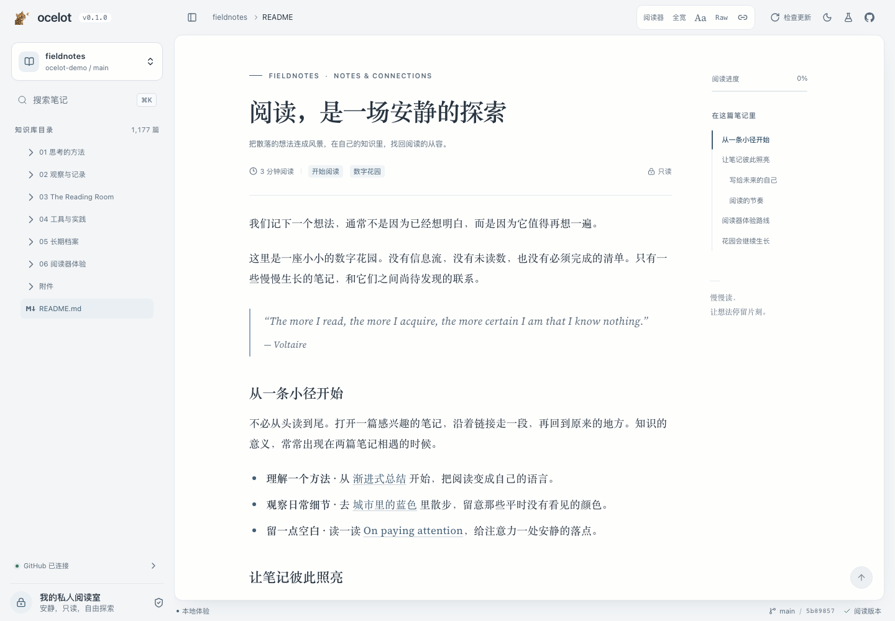

<p align="center">
  
</p>

<h1 align="center">Ocelot</h1>

<p align="center"><a href="../README.md">简体中文</a> · English</p>

A quiet, private reading room. Connect public or private Obsidian vaults on GitHub and read through folders,
wiki links and article outlines. Ocelot is a single-user reader; source repositories remain read-only.

Basalt **2.1.8** supplies controls and layout, Pierre Trees supplies virtualized navigation, and Chinese/English
document typography takes cues from [Kami](https://github.com/tw93/Kami). The cool blue-gray interface supports
light/dark themes, mobile layouts, keyboard navigation and reduced motion.

<picture>
  <source media="(prefers-color-scheme: dark)" srcset="assets/reader-dark.png">
  
</picture>

## Try it locally

Use Node.js 26.8.1 and Bun 1.4.0:

```sh
bun install --frozen-lockfile
bun run dev
```

Open <https://ocelot.dev.hexly.ai/> with [local Caddy HTTPS](11-local-https.md)
(direct diagnostic port: `7049`). The demo uses a real local Wrangler Worker, SQLite D1 and disk-backed R2.
It needs no PAT or Cloudflare account and stores its data under `.wrangler/state`.

Synthetic fixtures provide three repositories, 1,177 visible notes in the main vault, original images and two Git revisions.
The welcome note links to a 48-chapter article with 144 outline entries and illustrated Markdown examples with varied image dimensions.
The top-right flask button demonstrates slow loading, expiry reminders, invalid credentials, rate limits, offline behavior and new commits.
Add the third example, `ocelot-demo/reading-room`, through the repository dialog.

## Reading and updates

- Render GFM, frontmatter, Obsidian wiki links and aliases, heading/block anchors, callouts, tables, code, math and Mermaid diagrams.
- Keep embedded notes and attachments on the same Git revision. External tracking images and executable content are blocked.
- Use a separate reader control group for full width, typography and Raw Markdown; scroll long outlines independently, return to the top and enlarge images in a lightbox.
- Search filenames and paths with `⌘K` / `Ctrl+K`. The tree supports keyboard selection, expansion and change indicators.
- Cache note content on demand. Conditional checks run every 60 seconds while the page is visible and pause when hidden. Unchanged trees are not transferred again.
- Apply updates explicitly while preserving the reading position and expanded folders. Slow requests keep the current article visible.
- Receive a reminder seven days before a PAT expires. After rotating it on the server, check again to resume reading.

## Engineering and verification

Vite, React and **TypeScript 7.0.2** form an MVVM application, with Biome and Husky.
The Worker validates Cloudflare Access identity; GitHub PATs stay in Worker Secrets.
D1 stores metadata and private R2 stores a rebuildable cache.
The sidebar shows the verified Access user's name and avatar without delaying reading.
The header and sidebar share a Basalt surface; the app version and GitHub link stay visible.

```sh
bun run check
bun run worker:check
bun x playwright install chromium
bun run test:e2e
bun run check:security
bun run release -- --dry-run
```

These commands cover static checks, non-View code coverage, the frontend build, a Worker dry run and browser acceptance.
Local verification records **163 unit tests and 17 browser tests passed**, with non-View statement/branch/function/line
coverage of **100% / 98.62% / 100% / 100%** and light, dark and mobile axe checks.
The [runtime and verification record](05-runtime-contract-and-verification.md) documents the evidence and support boundaries.

Production is live at **<https://ocelot.hexly.ai>**, protected by nocoo Cloudflare Access.
`GET /api/live` is the only unauthenticated health endpoint.
After verification and security checks, trusted `main` reuses D1/private R2, migrates, deploys and verifies the running revision.
Releases require successful CI/CD for the matching commit; see the [production acceptance record](09-identity-and-delivery.md).
Real vault access still requires a separate GitHub PAT in the `GITHUB_TOKEN` Worker Secret; follow [Running and deployment](06-running-and-deployment.md).
The default local demo does not connect to real GitHub repositories.

## Documentation

- [00 · Project status and index](00-project-status.md)
- [01 · Product and engineering contract](01-product-contract.md)
- [02 · GitHub authentication, caching and updates](02-github-auth-cache-and-sync.md)
- [03 · Reference projects](03-reference-projects.md)
- [04 · Implementation and local acceptance](04-implementation-and-local-testing.md)
- [05 · Runtime contract and verification](05-runtime-contract-and-verification.md)
- [06 · Running, PAT rotation and deployment](06-running-and-deployment.md)
- [07 · Basalt navigation and reading chrome](07-basalt-navigation.md)
- [08 · Visual identity](08-visual-identity.md) · [Brand assets](../assets/brand/README.md)
- [09 · Identity, versioning and delivery](09-identity-and-delivery.md)
- [Operations](../CLAUDE.md) · [Changelog](../CHANGELOG.md)
- [Contributor agreement](../AGENTS.md) · [Third-party notices](../THIRD_PARTY_NOTICES.md)

Make coherent atomic commits on `main`. This public repository contains the application and synthetic fixtures,
not private notes, real vault inventories or runtime credentials.
