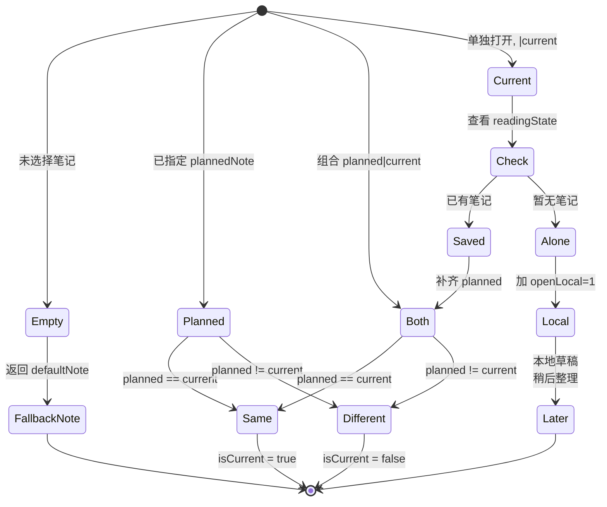
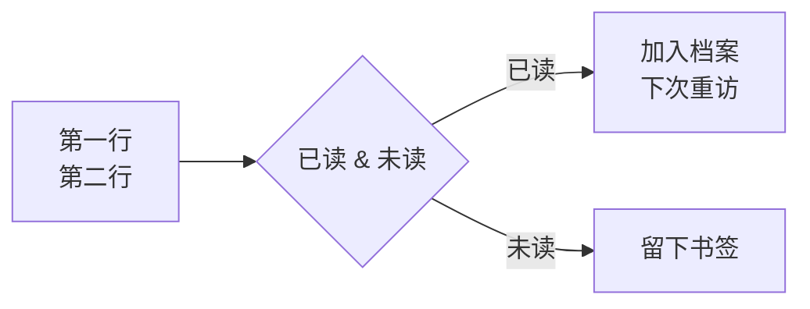
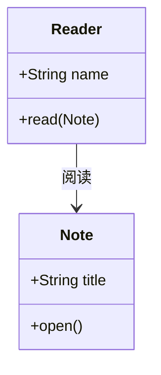
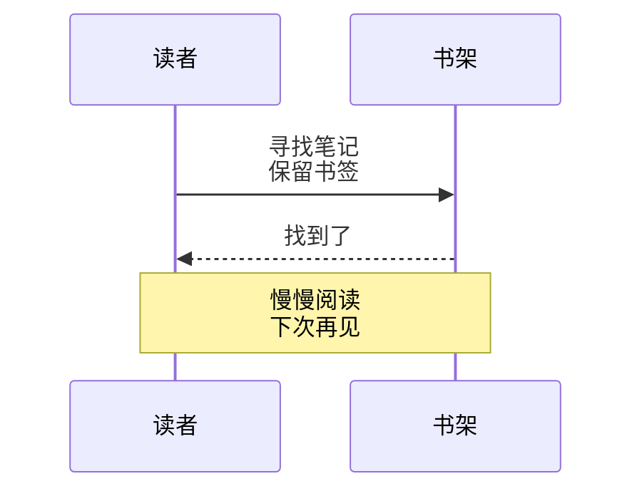
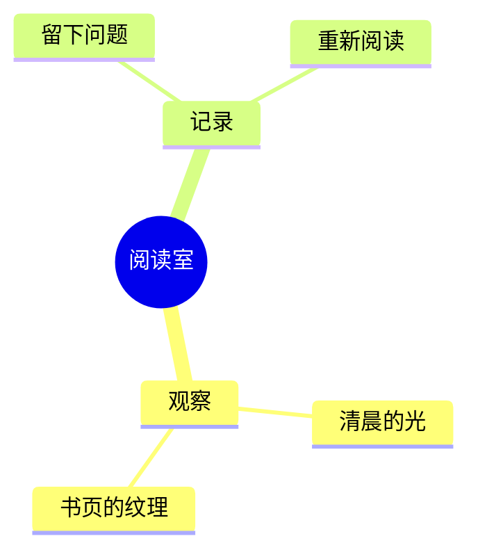

# 阅读室图示

这些图示使用合成内容。点击图示可以放大，并切换到原图尺寸查看细节。

## 阅读状态

```mermaid
stateDiagram-v2
    [*] --> Empty: 未选择笔记
    [*] --> Planned: 已指定 plannedNote
    [*] --> Both: 组合 planned|current
    [*] --> Current: 单独打开, |current

    Empty --> FallbackNote: 返回 defaultNote

    Planned --> Same: planned == current
    Planned --> Different: planned != current
    Both --> Same: planned == current
    Both --> Different: planned != current

    Current --> Check: 查看 readingState
    Check --> Saved: 已有笔记
    Check --> Alone: 暂无笔记
    Saved --> Both: 补齐 planned
    Alone --> Local: 加 openLocal=1
    Local --> Later: 本地草稿<br/>稍后整理

    Same --> [*]: isCurrent = true
    Different --> [*]: isCurrent = false
    FallbackNote --> [*]
    Later --> [*]
```

## 换行与符号

```mermaid
---
config:
  htmlLabels: true
---
flowchart LR
    A["第一行<br/>第二行"] --> B{"已读 & 未读"}
    B -->|已读| C["加入档案<br/>下次重访"]
    B -->|未读| D["留下书签"]
```

## 笔记与读者

```mermaid
classDiagram
    class Note {
        +String title
        +open()
    }
    class Reader {
        +String name
        +read(Note)
    }
    Reader --> Note : 阅读
```

## 一次重访

```mermaid
sequenceDiagram
    participant Reader as 读者
    participant Shelf as 书架
    Reader->>Shelf: 寻找笔记<br/>保留书签
    Shelf-->>Reader: 找到了
    Note over Reader,Shelf: 慢慢阅读<br/>下次再见
```

## 阅读的方向

```mermaid
mindmap
    root((阅读室))
        观察
            清晨的光
            书页的纹理
        记录
            留下问题
            重新阅读
```
